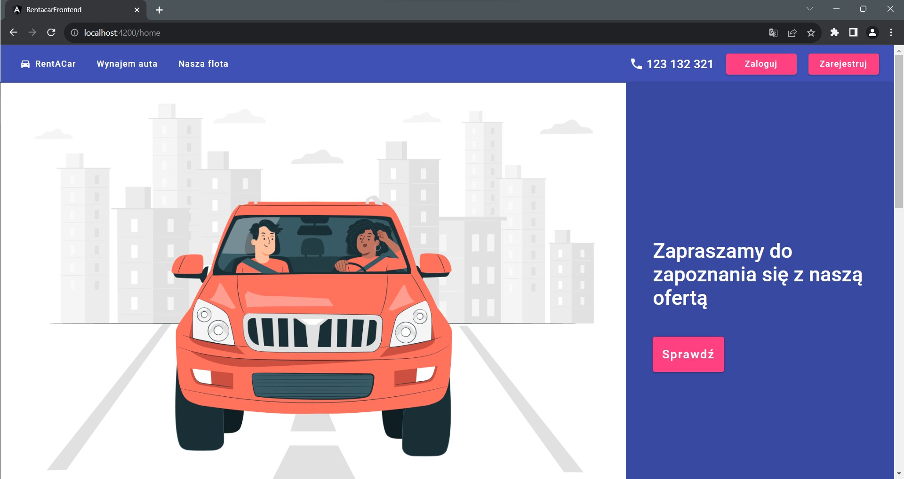
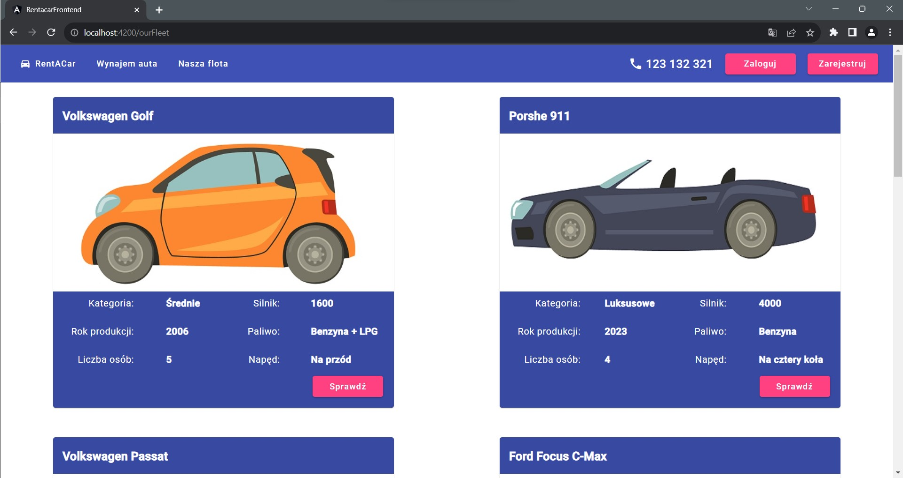
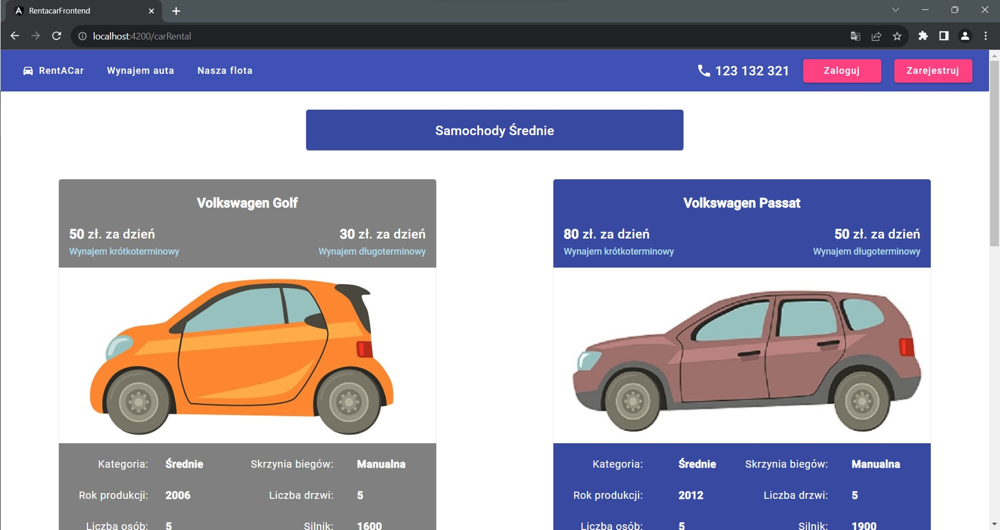
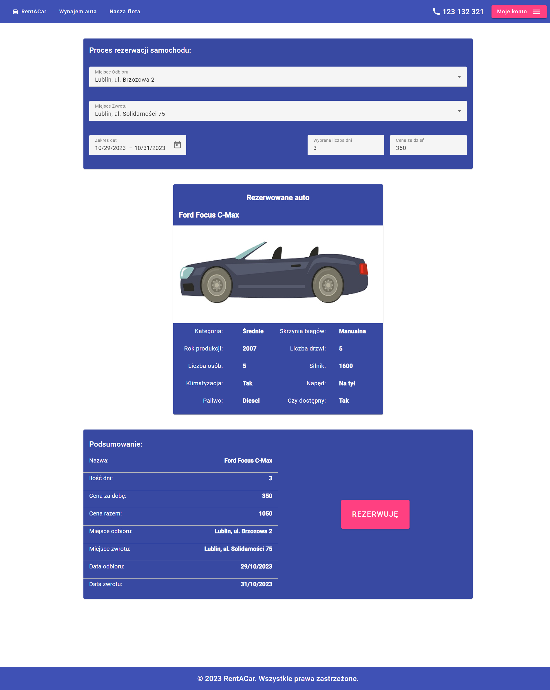
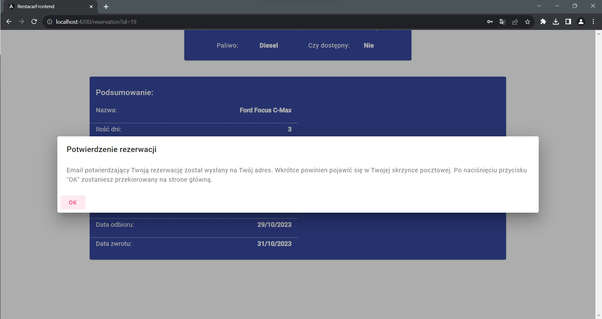
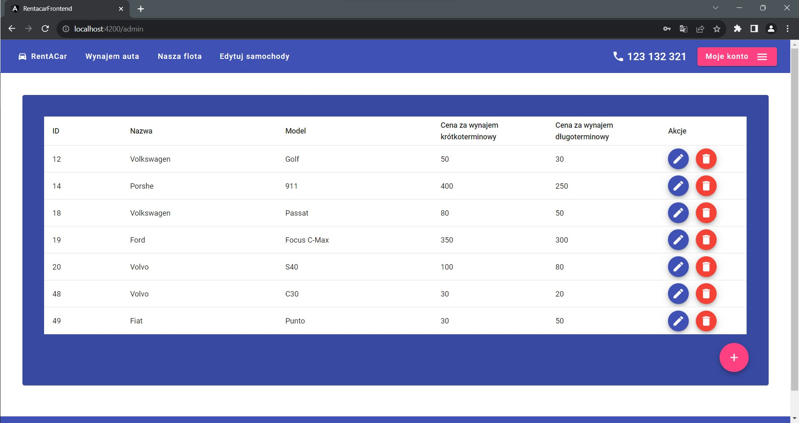
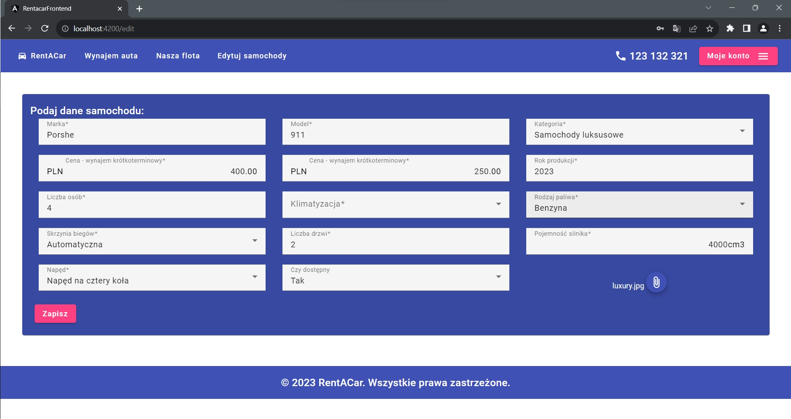

# RentACar - Frontend
This project was generated with [Angular CLI](https://github.com/angular/angular-cli) version 15.0.4.

RentACar's frontend is built using Angular and serves as the user interface for the application. This README file specifically covers the frontend part of the project.

## Overview

The frontend of RentACar provides a  very simple interface for both customers and administrators to interact with the car rental system. It seamlessly integrates with the backend to offer features such as browsing available vehicles, making reservations, and managing the vehicle fleet.

## Features

- **User Authentication**: Users can create accounts and log in to be able to make car reservations
- **Vehicle Browsing**: Browse the available vehicles with detailed information.
- **Reservation**: Easily make reservations for specific vehicles and durations.
- **Admin Dashboard**: Administrators have access to a dashboard for fleet management.

## Technologies Used

The frontend of RentACar is built with Angular, a popular web application framework. It uses HTML, CSS, and TypeScript to create user interface.
## Screenshots

Here are some screenshots of the frontend interface:

<!-- Add more screenshots as needed -->

